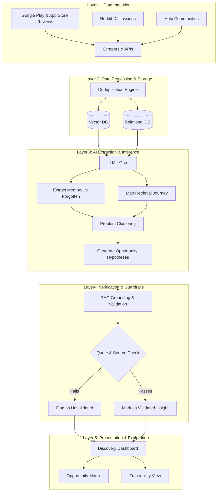

# AI-Powered Discovery Engine — System Architecture

This document outlines the detailed system architecture for the Google Photos AI-Powered Discovery Engine, derived directly from the project's [context.md](./context.md). The architecture is heavily optimized for **evidence traceability**, **anti-hallucination**, and **insight validation**.

---

## 1. High-Level Architecture Overview

The system operates over five primary layers that mirror the core pipeline: **Discover → Structure → Quantify → Compare → Prioritize**.

1. **Data Ingestion Layer:** Gathers multi-source raw user evidence.
2. **Data Processing & Storage Layer:** Deduplicates, structures, and stores data.
3. **AI Extraction & Inference Layer:** Applies LLMs to analyze conversations, identify patterns, and generate problem hypotheses.
4. **Verification & Guardrail Layer:** Ensures strict anti-hallucination and evidence validation.
5. **Presentation & Exploration Layer (Discovery Dashboard):** Provides an interface for the Product Manager (PM) to query, compare, and trace insights.

### System Workflow Diagram

---

## 2. Layer 1: Data Ingestion Layer
Responsible for continuously pulling and aggregating user conversations from diverse public sources.

- **Sources:** Google Play Store, Apple App Store, Reddit (e.g., r/googlephotos), Google Photos Help Communities, public forums.
- **Ingestion Mechanisms:**
  - **APIs:** Reddit API, App Store APIs.
  - **Scrapers / Crawlers:** Custom python scripts for public forums and help communities.
  - **Workflow Automation:** Tools like n8n or Zapier to orchestrate periodic ingestion.
- **Output:** Raw text, timestamps, source URLs, source types, and basic metadata.

---

## 3. Layer 2: Data Processing & Storage Layer
Prepares the data for AI analysis and ensures no duplication skews the prioritization metrics.

- **Deduplication Engine:**
  - Identifies reposts, syndicated content, and duplicate threads.
  - **Requirement:** Ensure independent evidence counts are separated from raw mention counts.
- **Storage Systems:**
  - **Relational/Document Database (e.g., PostgreSQL, MongoDB):** Stores raw conversations, metadata (URLs, dates), and the final structured problem clusters.
  - **Vector Database (e.g., Pinecone, Milvus):** Stores embeddings of user quotes to enable semantic similarity searches and problem clustering.
- **Output:** Clean, deduplicated, and vector-embedded datasets ready for inference.

---

## 4. Layer 3: AI Extraction & Inference Layer
The core intelligent component that transforms unstructured text into structured insights using a 4-layer interpretation model (Evidence → Pattern → Problem → Opportunity).

- **Entity & Memory Extraction Module:**
  - **Task:** Uses LLMs (e.g., Groq) to parse a conversation and extract *What is remembered* vs. *What is forgotten*.
- **Journey Mapping Module:**
  - **Task:** Identifies where retrieval breaks down (e.g., First Attempt, Reformulation, Abandonment).
- **Clustering Engine:**
  - **Task:** Groups similar extractions into "Candidate Problems" (e.g., *Forgotten Date*, *Context-Heavy Memory*).
- **Opportunity Generation Module:**
  - **Task:** Generates potential product opportunities based on clustered problems. **Rule:** These must be flagged as "Hypotheses".

---

## 5. Layer 4: Verification & Guardrail Layer
The most critical architectural component to satisfy the strict anti-hallucination constraints. All outputs from Layer 3 must pass through Layer 4 before reaching the PM.

- **Retrieval-Augmented Generation (RAG) Grounding:**
  - Any analytical answer or summarized claim must be generated strictly from retrieved evidence in the Vector DB, not the LLM's pretrained knowledge.
- **Guardrail Modules:**
  1. **Citation Checker:** Validates that every claim points to a specific database ID/URL.
  2. **Quote Integrity Checker:** Performs string matching to ensure generated quotes appear *verbatim* in the source text.
  3. **Quantification Validator:** Prevents the LLM from outputting estimated percentages (e.g., "63% of users") unless it is passing through a deterministic counting function.
  4. **Confidence Scorer:** Downgrades claims to "Insufficient Evidence" or "Low Confidence" if the number of independent sources falls below a threshold.

---

## 6. Layer 5: Presentation & Exploration Layer (Discovery Dashboard)
The user interface where the PM interacts with the Discovery Engine.

- **Search & Query Interface:** Allows natural language queries like *"What happens after a user fails to find a travel photo?"*
- **Opportunity Explorer (The Matrix):**
  - A matrix comparing Retrieval Problems across dimensions: *Evidence Volume*, *User Need*, *Segment Concentration*, and *Evidence Confidence*.
- **Traceability View:**
  - A drill-down UI that allows the PM to click on an *Opportunity* → view the *Problem* → view the *Pattern* → view the *Raw Evidence* → click through to the *Original URL*.
- **Segment Dashboard:** Visualizes retrieval issues filtered by user type or content type (e.g., Documents vs. Travel memories).

---

## 7. Data Flow Example

1. **User Post on Reddit:** *"I know I took a picture of my medical prescription during my Goa trip, but searching 'medicine' doesn't work and I can't remember the date."*
2. **Ingestion (Layer 1):** Scraped via Reddit API, stored with URL and timestamp.
3. **Processing (Layer 2):** Deduplicated and embedded into the Vector DB.
4. **Extraction (Layer 3):** 
   - *Remembered:* Trip Context (Goa), Object (Medical prescription).
   - *Forgotten:* Exact Date, Text in image.
   - *Failure Point:* First retrieval attempt (Query mismatch).
5. **Clustering (Layer 3):** Assigned to Candidate Problem: *Context-Heavy Memory*.
6. **Guardrails (Layer 4):** System verifies the quote exists in the Reddit post and flags the opportunity as an unvalidated hypothesis.
7. **Dashboard (Layer 5):** PM sees the "Context-Heavy Memory" problem cluster grow by 1 evidence count, clicks it, and traces it back to the exact Reddit thread.
